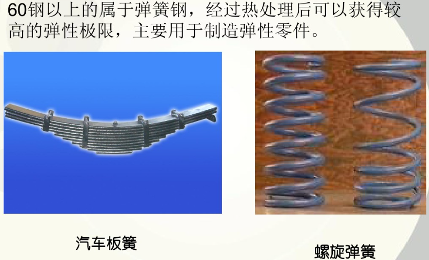

[TOC]

---

# 材料理论
1. 碳是钢铁材料的重要组分。
2. 含碳量[表示为质量分数，符号为wo，或w(C)]的多少对钢铁的性能有重要作用。也正是由于钢中含有一定量的碳，才能对钢进行热处理，才能调节或改变其机械性能。
3. 通常把含碳量w(C)2％作为区别钢和铁的分界线。
> - w(C) 低碳钢 <0．25％ 钢 <0.6% 高碳钢≤2％ 铁
4. 在一定范围内，随着含碳量的增加，钢的硬度和强度得到提高，但其塑性和韧性降低。
5. 碳对钢的组织的影响主要是扩大Y相区，但因渗碳体的形成，不能无限固溶。在铁和Y铁中碳的最大溶解度依次为0．02％及2．1％。
6. 在钢中，碳可与基体元素铁形成碳化物，还可与钛、铌、锆、钒、钼、钨、铬、锰等形成碳化物，统称为化合碳。铁碳固溶体中的碳、无定形碳、石墨碳、退火碳等总称为游离碳。高碳钢经退火处理后也会有部分游离碳析出。
7. 在铸铁中，碳除了极少量固溶于铁素体外，大部分以游离(石墨碳)形态、化合形态或两者并存的形态存在。主要以石墨碳形态存在的铸铁，其断口呈灰色，故称为“灰口铁”，炼钢生铁中的碳大多以化合态Fe3C形态存在，其断口呈灰白色，故称为“白口铁”。化合碳和游离碳的合称为总碳量。游离碳不溶于酸，化合碳可溶于酸，利用这一特性可使两者分离。

钢中含碳量增加，屈服点和抗拉强度升高，但塑性和冲击性降低
当含碳量超过0.23%时，钢的焊接性能变坏，因此用于焊接的低合金结构钢，含碳量一般低于0.20%。 
碳量高还会降低钢的耐大气腐蚀能力，在露天料场的高碳钢就易锈蚀；此外，碳能增加钢的冷脆性和时效敏感性。

QXXXAF Q:屈服强度 A:质量等级 F:脱氧方法沸腾F半镇静钢b镇静钢Z(常省略)特殊镇静钢T

Q195,Q215,Q235常用于一般桥梁，建筑结构，普通机械零件如螺钉，螺母等
Q255,Q275可用于受力圈套的机械零件，如链轮，拉杆等

优质碳素结构钢，用两位数字表示钢中平均含碳量的万分数
如45钢，wc为45/10000 = 0.45%
65Mn wc=0.65%,Mn含量较高(0.9~1.2%)

碳素工具钢
T12A T碳素工具钢 A高级优质 wc 12/1000=1.2% 
常用于冲头，凿子，钻头，锉刀，量规等

# 热处理工艺
1. why heat treatment? 
> 有利于制造加工，提高零件性能
2. 基本原理
> 通过加热，保温冷却及环境气氛改变工件的组织或状态，进而达到热处理的目的
> 处理三要素：温度，时间，环境气氛

---
化学热处理:渗碳,渗氮,碳氮共渗
## 渗碳

> 对金属表面处理的一种，采用渗碳的多为低碳钢或低合金钢，具体方法是将工件置入具有活性渗碳介质中，加热到900--950摄氏度的单相奥氏体区，保温足够时间后，使渗碳介质中分解出的活性碳原子渗入钢件表层，从而获得表层高碳，心部仍保持原有成分

## 调质
> 调质（quenching and high temperature tempering）即淬火和高温回火的综合热处理工艺。 调质件大都在比较大的动载荷作用下工作，它们承受着拉伸、压缩、弯曲、扭转或剪切的作用，有的表面还具有摩擦，要求有一定的耐磨性等等。总之，零件处在各种复合应力下工作。这类零件主要为各种机器和机构的结构件，如轴类、连杆、螺栓、齿轮等，在机床、汽车和拖拉机等制造工业中用得很普遍。尤其是对于重型机器制造中的大型部件，调质处理用得更多．因此，调质处理在热处理中占有很重要的位置。在机械产品中的调质件，因其受力条件不同，对其所要求的性能也就不完全一样。一般说来，各种调质件都应具有优良的综合力学性能，即高强度和高韧性的适当配合，以保证零件长期顺利工作。

## 热处理四把火
### 淬火

> 钢的淬火是将钢加热到临界温度Ac3（亚共析钢）或Ac1（过共析钢）以上温度，保温一段时间，使之全部或部分奥氏体化，然后以大于临界冷却速度的冷速快冷到Ms以下（或Ms附近等温）进行马氏体（或贝氏体）转变的热处理工艺。
> 通常也将铝合金、铜合金、钛合金、钢化玻璃等材料的固溶处理或带有快速冷却过程的热处理工艺称为淬火。
> 淬火的目的是使过冷奥氏体进行马氏体或贝氏体转变，得到马氏体或贝氏体组织，然后配合以不同温度的回火，以大幅提高钢的强度、硬度、耐磨性、疲劳强度以及韧性等，从而满足各种机械零件和工具的不同使用要求。
> 也可以通过淬火满足某些特种钢材的铁磁性、耐蚀性等特殊的物理、化学性能。
> 常用的淬冷介质有盐水、水、矿物油、空气等。
> 常用的钢在加热到临界温度以上时，原有在室温下的组织将全部或大部转变为奥氏体。随后将钢浸入水或油中快速冷却，奥氏体即转变为马氏体。与钢中其他组织相比，马氏体硬度最高。
> 淬火时的快速冷却会使工件内部产生内应力，当其大到一定程度时工件便会发生扭曲变形甚至开裂。为此必须选择合适的冷却方法。
> 根据冷却方法，淬火工艺分为单液淬火、双介质淬火、马氏体分级淬火和贝氏体等温淬火4类。
> 淬火工件一般采用洛氏硬度计测定其HRC值。淬火的薄硬钢板和表面淬火工件可测定HRA值，而厚度小于0.8mm的淬火钢板、浅层表面淬火工件和直径小于5mm的淬火钢棒，可改用表面洛氏硬度计测定其HRC值。

### 回火
> 回火是指将经过淬火的工件重新加热到低于下临界温度AC1-710℃（加热时珠光体向奥氏体转变的开始温度）的适当温度，保温一段时间后在空气或水、油等介质中冷却的金属热处理工艺。或将淬火后的合金工件加热到适当温度，保温若干时间，然后缓慢或快速冷却。一般用于减小或消除淬火钢件中的内应力，或者降低其硬度和强度，以提高其延性或韧性。淬火后的工件应及时回火，通过淬火和回火的相配合，才可以获得所需的力学性能。
> 回火一般紧接着淬火进行，其目的是：
    1、消除工件淬火时产生的残留应力，防止变形和开裂；
    2、调整工件的硬度、强度、塑性和韧性，达到使用性能要求；
    3、稳定组织与尺寸，保证精度；
    4、改善和提高加工性能。因此，回火是工件获得所需性能的最后一道重要工序。
> 按回火温度范围，回火可分为低温回火、中温回火和高温回火。
#### 低温回火
- 工件在150——250℃进行的回火。
- 目的是保持淬火工件高的硬度和耐磨性，降低淬火残留应力和脆性
回火后得到回火马氏体，指淬火马氏体低温回火时得到的组织。
- 力学性能：58——64HRC，高的硬度和耐磨性。
- 应用范围：刃具、量具、模具、滚动轴承、渗碳及表面淬火的零件等。
#### 中温回火
- 工件在350——500 ℃之间进行的回火。
- 目的是得到较高的弹性和屈服点，适当的韧性。回火后得到回火屈氏体，指马氏体回火时形成的铁素体基体内分布着极其细小球状碳化物（或渗碳体）的复相组织。
- 力学性能：35——50HRC，较高的弹性极限、屈服点和一定的韧性。
- 应用范围：弹簧、锻模、冲击工具等。
#### 高温回火
- 工件在500℃以上进行的回火。
- 目的是得到强度、塑性和韧性都较好的综合力学性能。
- 回火后得到回火索氏体，指马氏体回火时形成的铁素体基体内分布着细小球状碳化物（包括渗碳体）的复相组织。
- 力学性能：200——350HBS，较好的综合力学性能。
- 应用范围：广泛用于各种较重要的受力结构件，如连杆、螺栓、齿轮及轴类零件等。

表面淬火后材料表面获得硬而耐磨的马氏体组织,而心部仍然能保留原来的韧性有塑性较好的组织.适用于表面淬火工艺的金属材料一般为中碳或中碳合金钢.在表淬处理前需要进行正火处理或调质处理,表面淬火后一般都需要进行低温回火处理.
工件淬火并高温回火的复合热处理工艺称为调质。调质不仅作最终热处理，也可作一些精密零件或感应淬火件预先热处理。
45钢正火和调质后性能比较见下表所示。
45钢（φ20mm——φ40mm）正火和调质后性能比较

热处理方法 | 力学性能 | 力学性能 | 力学性能 | 力学性能 | 组织
--- | --- | --- | --- | --- | ---
--- | σb/Mpa | δ×100 | Ak/J | HBS | ---
正火 | 700～800 | 15～20 | 40～64 | 163～220 | 索氏体+铁素体
调质 | 750～850 | 20～25 | 64～96 | 210～250 | 回火索氏体

钢淬火后在300℃左右回火时，易产生不可逆回火脆性，为避免它，一般不在250——350℃ 范围内回火。含铬、镍、锰等元素的合金钢淬火后在500——650℃回火，缓冷易产生可逆回火脆性，为防止它，小零件可采用回火时快冷；大零件可选用含钨或钼的合金钢。

### 正火
> 是将工件加热至Ac3(Ac是指加热时自由铁素体全部转变为奥氏体的终了温度，一般是从727℃到912℃之间)或Acm(Acm是实际加热中过共析钢完全奥氏体化的临界温度线 )以上30~50℃，保温一段时间后，从炉中取出在空气中或喷水、喷雾或吹风冷却的金属热处理工艺。其目的是在于使晶粒细化和碳化物分布均匀化。正火与退火的不同点是正火冷却速度比退火冷却速度稍快，因而正火组织要比退火组织更细一些，其机械性能也有所提高。另外，正火炉外冷却不占用设备，生产率较高，因此生产中尽可能采用正火来代替退火。对于形状复杂的重要锻件，在正火后还需进行高温回火（550-650℃）高温回火的目的在于消除正火冷却时产生的应力，提高韧性和塑性。。正火主要用于钢铁工件。一般钢铁正火与退火相似，但冷却速度稍大，组织较细。常用于改善材料的切削性能，也有时用于对一些要求不高的零件作为最终热处理。
> 正火的主要应用范围有：
①用于低碳钢，正火后硬度略高于退火，韧性也较好，可作为切削加工的预处理。
②用于中碳钢，可代替调质处理(淬火+高温回火）作为最后热处理，也可作为用感应加热方法进行表面淬火前的预备处理。
③用于工具钢、轴承钢、渗碳钢等，可以消降或抑制网状碳化物的形成，从而得到球化退火所需的良好组织。
④用于铸钢件，可以细化铸态组织，改善切削加工性能。
⑤用于大型锻件，可作为最后热处理，从而避免淬火时较大的开裂倾向。
⑥用于球墨铸铁，使硬度、强度、耐磨性得到提高，如用于制造汽车、拖拉机、柴油机的曲轴、连杆等重要零件。
⑦过共析钢球化退火前进行一次正火，可消除网状二次渗碳体，以保证球化退火时渗碳体全部球粒化。
正火后的组织：亚共析钢为F+S，共析钢为S，过共析钢为S+二次渗碳体，且为不连续。

（1）去除材料的内应力
（2）降低材料的硬度，提高塑性
这样是为了接下来的加工做准备。和退火差不多的作用，只是为了提高效率，降低成本。

### 退火
> 将工件加热到适当温度，根据材料和工件尺寸采用不同的保温时间，然后进行缓慢冷却(冷却速度最慢)目的是使金属内部组织达到或接近平衡状态，获得良好的工艺性能和使用性能,或者为进一步淬火作组织准备。
> 退火的一个最主要工艺参数是最高加热温度（退火温度），大多数合金的退火加热温度的选择是以该合金系的相图为基础的，如碳素钢以铁碳平衡图为基础（图1）。各种钢(包括碳素钢及合金钢)的退火温度，视具体退火目的的不同而在各该钢种的Ac3以上、Ac1以上或以下的某一温度。各种非铁合金的退火温度则在各该合金的固相线温度以下、固溶度线温度以上或以下的某一温度。

热处理温度与Fe3C铁相图

常见金相组织(马氏体/奥氏体/铁素体)

热处理的加热温度

热处理TTT图（time-temprature-transformation）

淬火类型

常用零件热处理

